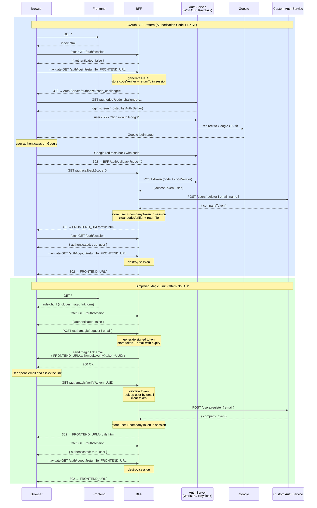

```mermaid
sequenceDiagram
    participant B as Browser
    participant FA as Frontend
    participant BFF as BFF
    participant AS as Auth Server<br/>(WorkOS / Keycloak)
    participant Google as Google
    participant CAS as Custom Auth Service

    rect rgb(220, 235, 255)
        note over B,CAS: OAuth BFF Pattern (Authorization Code + PKCE)

        B->>FA: GET /
        FA-->>B: index.html

        B->>BFF: fetch GET /auth/session
        BFF-->>B: { authenticated: false }

        B->>BFF: navigate GET /auth/login?returnTo=FRONTEND_URL
        note over BFF: generate PKCE<br/>store codeVerifier + returnTo in session
        BFF-->>B: 302 → Auth Server /authorize?code_challenge=...

        B->>AS: GET /authorize?code_challenge=...
        AS-->>B: login screen (hosted by Auth Server)
        B->>AS: user clicks "Sign in with Google"
        AS->>Google: redirect to Google OAuth
        Google-->>B: Google login page
        note over B: user authenticates on Google
        B->>AS: Google redirects back with code
        AS-->>B: 302 → BFF /auth/callback?code=X

        B->>BFF: GET /auth/callback?code=X
        BFF->>AS: POST /token (code + codeVerifier)
        AS-->>BFF: { accessToken, user }
        BFF->>CAS: POST /users/register { email, name }
        CAS-->>BFF: { companyToken }
        note over BFF: store user + companyToken in session<br/>clear codeVerifier + returnTo
        BFF-->>B: 302 → FRONTEND_URL/profile.html

        B->>BFF: fetch GET /auth/session
        BFF-->>B: { authenticated: true, user }

        B->>BFF: navigate GET /auth/logout?returnTo=FRONTEND_URL
        note over BFF: destroy session
        BFF-->>B: 302 → FRONTEND_URL/
    end

    rect rgb(220, 255, 220)
        note over B,CAS: Simplified Magic Link Pattern No OTP

        B->>FA: GET /
        FA-->>B: index.html (includes magic link form)

        B->>BFF: fetch GET /auth/session
        BFF-->>B: { authenticated: false }

        B->>BFF: POST /auth/magic/request { email }
        note over BFF: generate signed token<br/>store token + email with expiry
        BFF->>B: send magic link email<br/>( FRONTEND_URL/auth/magic/verify?token=UUID )
        BFF-->>B: 200 OK

        note over B: user opens email and clicks the link

        B->>BFF: GET /auth/magic/verify?token=UUID
        note over BFF: validate token<br/>look up user by email<br/>clear token
        BFF->>CAS: POST /users/register { email }
        CAS-->>BFF: { companyToken }
        note over BFF: store user + companyToken in session
        BFF-->>B: 302 → FRONTEND_URL/profile.html

        B->>BFF: fetch GET /auth/session
        BFF-->>B: { authenticated: true, user }

        B->>BFF: navigate GET /auth/logout?returnTo=FRONTEND_URL
        note over BFF: destroy session
        BFF-->>B: 302 → FRONTEND_URL/
    end
```
