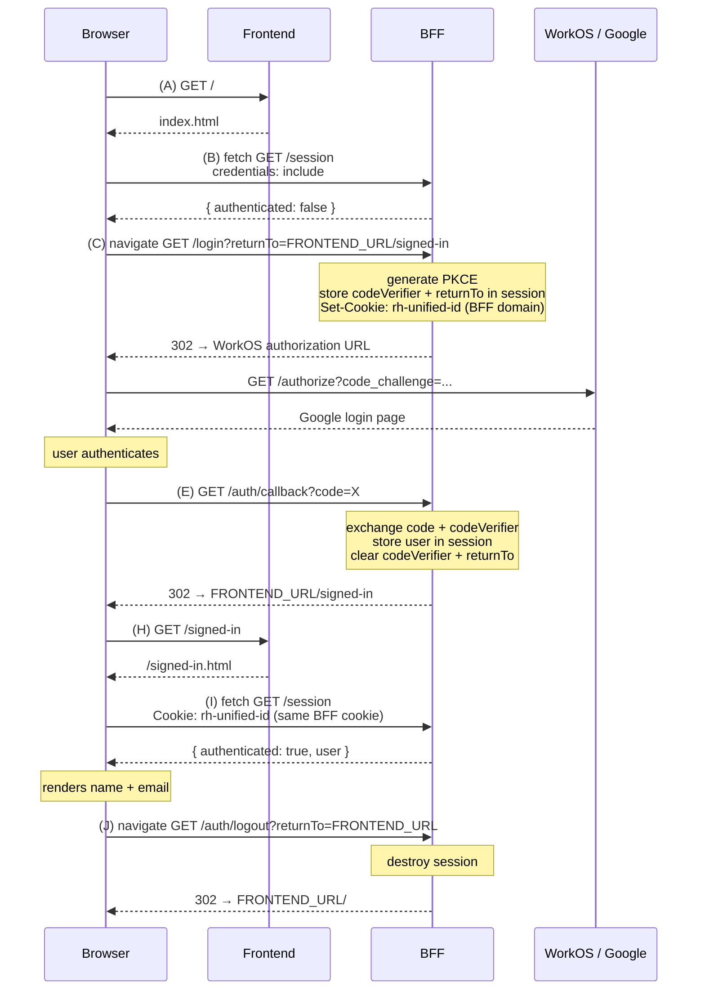

```mermaid
sequenceDiagram
    participant B as Browser
    participant FA as Frontend
    participant BFF as BFF
    participant W as WorkOS / Google

    B->>FA: (A) GET /
    FA-->>B: index.html

    B->>BFF: (B) fetch GET /session<br/>credentials: include
    BFF-->>B: { authenticated: false }

    B->>BFF: (C) navigate GET /login?returnTo=FRONTEND_URL/signed-in
    note over BFF: generate PKCE<br/>store codeVerifier + returnTo in session<br/>Set-Cookie: rh-unified-id (BFF domain)
    BFF-->>B: 302 → WorkOS authorization URL

    B->>W: GET /authorize?code_challenge=...
    W-->>B: Google login page
    note over B: user authenticates

    B->>BFF: (E) GET /auth/callback?code=X
    note over BFF: exchange code + codeVerifier<br/>store user in session<br/>clear codeVerifier + returnTo
    BFF-->>B: 302 → FRONTEND_URL/signed-in

    B->>FA: (H) GET /signed-in
    FA-->>B: /signed-in.html

    B->>BFF: (I) fetch GET /session<br/>Cookie: rh-unified-id (same BFF cookie)
    BFF-->>B: { authenticated: true, user }
    note over B: renders name + email

    B->>BFF: (J) navigate GET /auth/logout?returnTo=FRONTEND_URL
    note over BFF: destroy session
    BFF-->>B: 302 → FRONTEND_URL/
```
