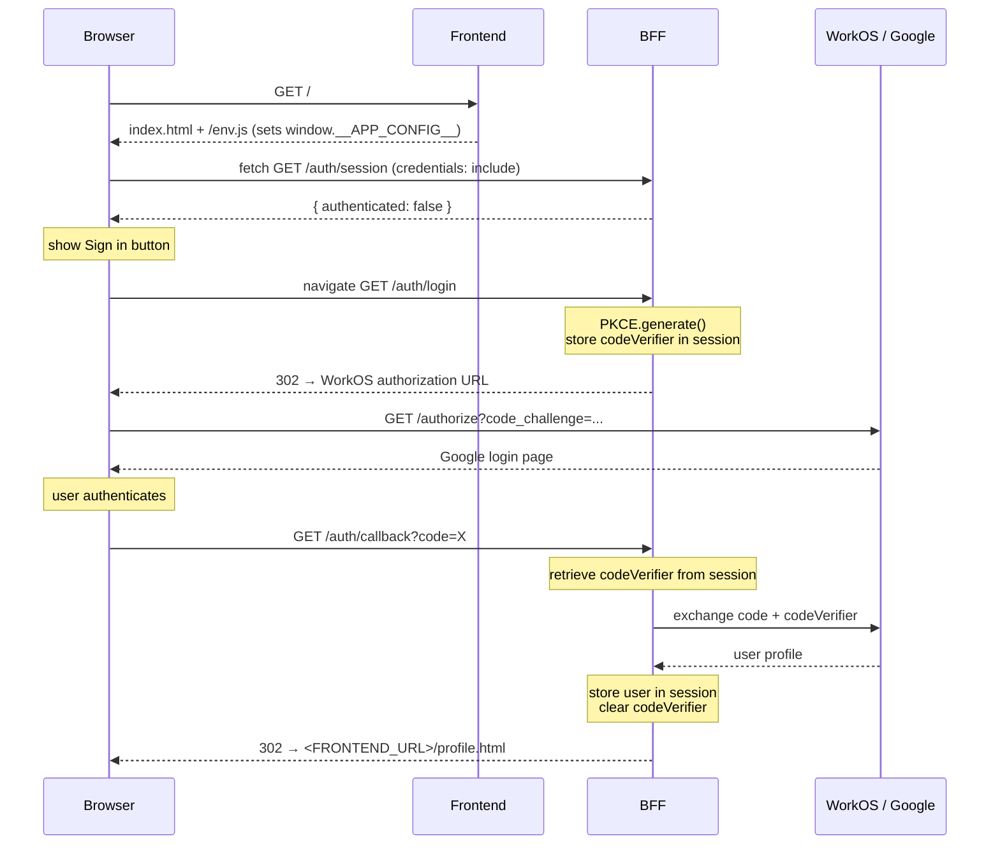

# Architecture Design: WorkOS SSO PoC

## System Architecture

```
  Browser
    │
    ├─(A) GET <FRONTEND_URL>/             ──► Frontend Server
    │                                          serves index.html + env.js
    │
    ├─(B) fetch <BFF_URL>/auth/session    ──► BFF Server
    │◄─── { authenticated, user }  ◄──────────
    │
    ├─(C) navigate <BFF_URL>/auth/login   ──► BFF Server
    │◄─── 302 → WorkOS authorization URL ◄────
    │
    ├─(D) browser → WorkOS / Google login
    │
    ├─(E) GET <BFF_URL>/auth/callback     ──► BFF Server
    │         (WorkOS redirect)                exchanges code+verifier
    │◄─── 302 → <FRONTEND_URL>/profile.html
    │
    ├─(H) GET <FRONTEND_URL>/profile.html ──► Frontend Server
    │
    ├─(I) fetch <BFF_URL>/auth/session    ──► BFF Server
    │◄─── { authenticated: true, user }  ◄────
    │      (page renders name + email)
    │
    └─(J) navigate <BFF_URL>/auth/logout  ──► BFF Server
          ◄─── 302 → <FRONTEND_URL>/  ◄────────
```

## Tech Stack

| Category      | Choice                  | Rationale                                                          |
|---------------|-------------------------|--------------------------------------------------------------------|
| Runtime       | Node.js 20 LTS          | Stable, wide ecosystem, matches Express requirement                |
| Frontend srv  | Express 4               | Lightweight static file server; also serves dynamic `env.js`      |
| BFF framework | Express 4               | Required by spec; minimal boilerplate for auth routes             |
| WorkOS SDK    | @workos-inc/node        | Required by spec; provides SSO client, PKCE class, profile types  |
| Session store | express-session (memory)| In-memory only per spec; no database required for PoC             |
| CORS          | cors (npm)              | Handles `Access-Control-Allow-Origin` + credentials headers cleanly|
| Config        | shared/config.js        | Single module deriving all env-dependent values from `APP_ENV`    |
| Process mgmt  | concurrently            | Starts both servers with a single `npm start`                     |
| Testing       | Jest + Supertest        | Jest is the standard Node test runner; Supertest enables HTTP route testing without a live server |

## Component Design

### Component Hierarchy

```
workos-sso-poc/
├── shared/
│   └── config.js          # APP_ENV-driven config (URLs, cookie flags)
├── frontend/
│   ├── server.js           # express.static + GET /env.js route
│   └── public/
│       ├── index.html      # login page
│       └── profile.html    # profile page
├── bff/
│   ├── server.js           # Express app: session, cors, auth router
│   └── routes/
│       └── auth.js         # /auth/session /auth/login /auth/callback /auth/logout
└── tests/
    ├── bff.test.js
    ├── auth.session.test.js
    ├── auth.login.test.js
    ├── auth.callback.test.js
    └── auth.logout.test.js
```

### Key Data Models

```js
// shared/config.js — shape
config = {
  appEnv:      'local' | 'production',
  frontendUrl: string,   // e.g. 'http://localhost:3000' or 'https://app.example.com'
  bffUrl:      string,   // e.g. 'http://localhost:3001' or 'https://api.example.com'
  cookie: {
    secure:   boolean,   // false in local, true in production
    sameSite: 'lax' | 'none',
    name:     'sid' | '__Host-sid',
  }
}

// Session shape (stored server-side in express-session)
session = {
  codeVerifier: string | undefined,   // set in /auth/login, cleared in /auth/callback
  user: {
    firstName: string,
    lastName:  string,
    email:     string,
  } | undefined
}

// GET /auth/session response
{ authenticated: false }
// or
{ authenticated: true, user: { firstName, lastName, email } }
```

### Runtime config injection (`/env.js`)

Static HTML cannot read Node env vars directly. The frontend server exposes a dynamic
`GET /env.js` route that writes `window.__APP_CONFIG__` so inline scripts can resolve
`BFF_URL` without hardcoding:

```js
// frontend/server.js — dynamic route (before express.static)
app.get('/env.js', (req, res) => {
  res.type('application/javascript')
  res.send(`window.__APP_CONFIG__ = ${JSON.stringify({ bffUrl: config.bffUrl })};`)
})
```

```html
<!-- index.html and profile.html -->
<script src="/env.js"></script>
<script>
  const BFF_URL = window.__APP_CONFIG__.bffUrl
  // fetch(BFF_URL + '/auth/session', { credentials: 'include' })
</script>
```

## Data Flow

### Login (US-2 → US-3)



## UI Wireframes

### index.html — Login Page
```
┌─────────────────────────────────┐
│                                 │
│        Welcome                  │
│                                 │
│   [ Sign in with Google ]       │
│                                 │
└─────────────────────────────────┘
```

### profile.html — Authenticated Page
```
┌─────────────────────────────────┐
│                                 │
│   You're logged in!             │
│                                 │
│   Name:   Jane Doe              │
│   Email:  jane@example.com      │
│                                 │
│   [ Sign out ]                  │
│                                 │
└─────────────────────────────────┘
```

## File Structure

```
workos-sso-poc/
├── package.json                   # root scripts: start, test
├── .env.example                   # documents both local and production vars
├── .gitignore
│
├── shared/
│   └── config.js                  # APP_ENV → { frontendUrl, bffUrl, cookie }
│
├── frontend/
│   ├── server.js                  # GET /env.js + express.static('./public'), port 3000
│   └── public/
│       ├── index.html             # login page (includes /env.js, inline <script>)
│       └── profile.html          # profile page (includes /env.js, inline <script>)
│
├── bff/
│   ├── server.js                  # express app: session, cors, mounts auth router, port 3001
│   └── routes/
│       └── auth.js                # /auth/session, /auth/login, /auth/callback, /auth/logout
│
└── tests/
    ├── bff.test.js                # CORS + session middleware
    ├── auth.session.test.js       # /auth/session
    ├── auth.login.test.js         # /auth/login
    ├── auth.callback.test.js      # /auth/callback
    └── auth.logout.test.js        # /auth/logout
```

## Summary

**Key decisions:**

- **`APP_ENV` flag in `shared/config.js`** — a single module reads `APP_ENV`, `FRONTEND_URL`, and `BFF_URL` from the environment and exports a `config` object consumed by both servers. This keeps all environment branching in one place.

- **`/env.js` dynamic route** — static HTML has no access to Node env vars. The frontend server exposes a tiny JS file that sets `window.__APP_CONFIG__.bffUrl`. Both HTML pages load it before their inline scripts, so `BFF_URL` is resolved at runtime without hardcoding.

- **Cookie flags driven by `APP_ENV`** — `local` uses `sameSite: 'lax'` + `secure: false` (HTTP-friendly); `production` uses `sameSite: 'none'` + `secure: true` (required for cross-origin cookies over HTTPS).

- **Two separate Express processes** — mirrors the RFC §6.1 diagram; `concurrently` starts both from a single `npm start`.

- **CORS pinned to `FRONTEND_URL`** — never a wildcard; satisfies CSRF defense (§6.1.3.3) in both environments.

- **Memory session store** — acceptable for PoC; not suitable for multi-instance production deployment.

- **Jest + Supertest** — BFF Express app is imported directly; no live port needed in tests.
